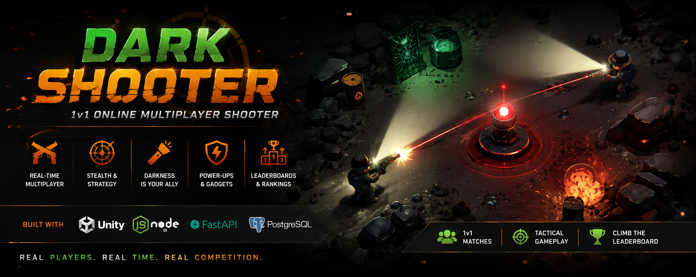
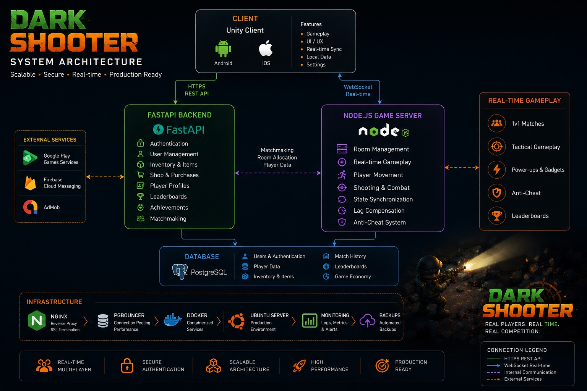
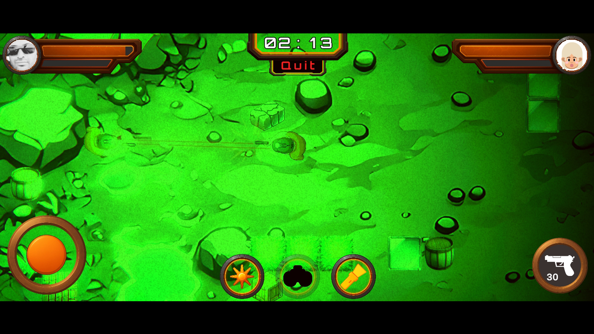
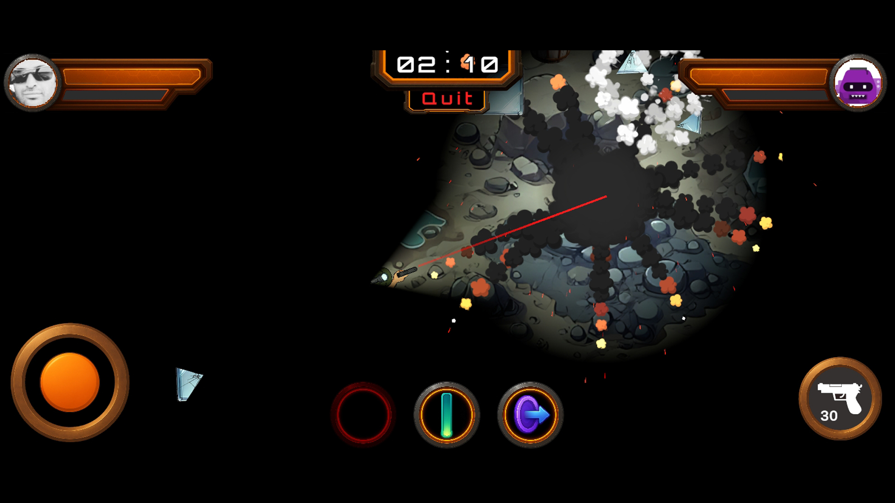
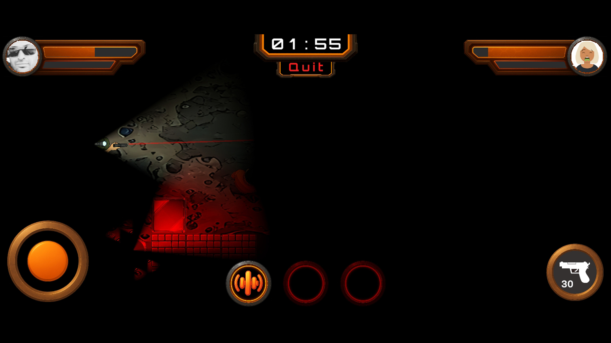
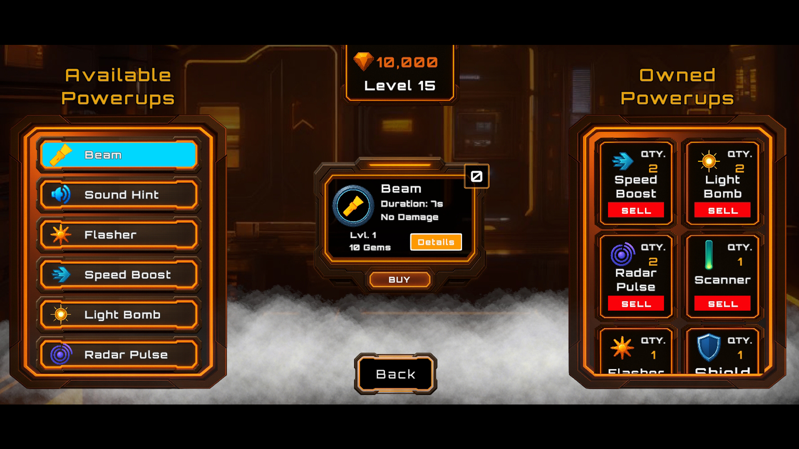

<p align="center">

</p>

<h1 align="center">
🎮 Dark Shooter
</h1>

<p align="center">
Production-Ready 1v1 Multiplayer Shooter Architecture Showcase
</p>

---

# Overview

Dark Shooter is a real-time online multiplayer mobile game built with Unity and designed around stealth, tactical gameplay, and server-authoritative networking.

This repository is a technical showcase of the project architecture.

The production source code remains private.

---

# System Architecture

<p align="center">
  
</p>

Dark Shooter uses a hybrid architecture that separates gameplay from backend services.

FastAPI handles authentication, player progression, inventory, purchases and REST APIs, while a dedicated Node.js game server manages real-time multiplayer gameplay over WebSockets.

This separation allows the gameplay server to remain lightweight while backend services scale independently.

---

# Features

- 🎮 Real-time Multiplayer
- 🌐 Dedicated Node.js Game Server
- ⚡ FastAPI Backend
- 🔐 Authentication System
- 🎯 Matchmaking
- 🗄 PostgreSQL Database
- ☁️ Cloud Deployment
- 📈 LiveOps Ready Infrastructure
- 💎 In-App Purchases
- 📺 AdMob Integration
- 📊 Leaderboards
- 🏆 Player Progression
- 🎁 Daily Rewards
- 🔄 Persistent Player Data

---

# Technology Stack

## Client

- Unity
- C#

## Backend

- FastAPI
- Node.js
- REST APIs
- WebSockets

## Database

- PostgreSQL

## Infrastructure

- Ubuntu
- Nginx
- Docker
- PgBouncer

---

# Architecture

```
                   Unity Client
                        │
         ┌──────────────┴──────────────┐
         │                             │
   REST API                     WebSocket
         │                             │
     FastAPI                  Node.js Game Server
         │                             │
         └──────────────┬──────────────┘
                        │
                  PostgreSQL
```

---

# Screenshots

<p align="center">







</p>

---

# Highlights

- Production-ready multiplayer architecture
- Server-authoritative gameplay
- Real-time synchronization
- Matchmaking system
- Authentication & player profiles
- Backend APIs
- Cloud deployment
- Scalable backend design

---

# Google Play

https://play.google.com/store/apps/details?id=pro.hossy.darkshooter

---

# About this Repository

This repository showcases the architecture, technologies, and production infrastructure behind Dark Shooter.

To protect commercial intellectual property, the complete source code is kept private.
